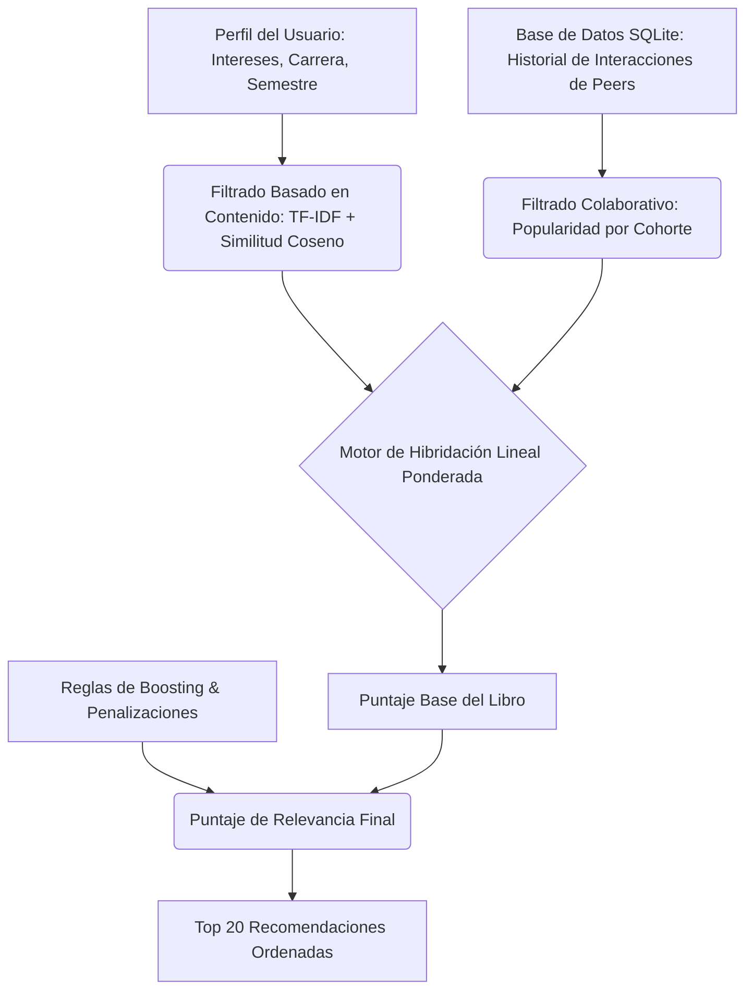
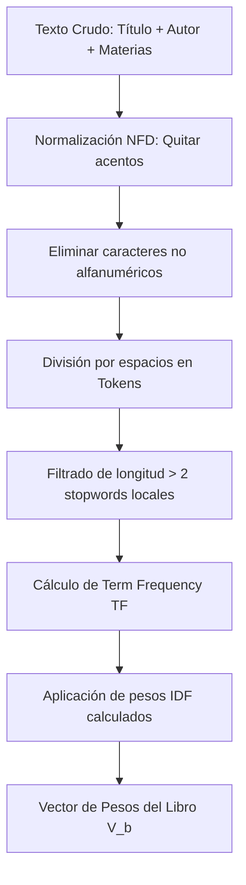

# Documentación del Sistema de Recomendación Inteligente (SRI) — BiblioFlix UADY

Esta documentación describe la arquitectura, algoritmos, y decisiones de diseño del Sistema de Recomendación Inteligente de la plataforma **BiblioFlix**, el cual está diseñado específicamente para los estudiantes de la Facultad de Ingeniería de la Universidad Autónoma de Yucatán (UADY).

---

## 1. Inicio en Frío (Cold Start) — [5 pts.]

El problema del "inicio en frío" ocurre cuando un sistema de recomendación debe operar sin tener suficiente información histórica previa (ya sea de nuevos usuarios, de nuevos elementos, o del sistema completo). **BiblioFlix** implementa tres estrategias robustas y complementarias para mitigar esta limitación:

### A. Inicio en Frío del Usuario (Onboarding Activo)
Cuando un estudiante accede a la plataforma por primera vez e ingresa su matrícula de 8 dígitos en la pantalla de **Onboarding**, el backend detecta que la cuenta no existe. Para resolver el vacío de información de inmediato:
1. El sistema solicita al usuario que complete un asistente dinámico de 4 pasos.
2. Captura explícitamente su **Carrera** (ej. *Sistemas, Civil, Mecatrónica, Industrial, Renovables, Logística*), su **Semestre** actual y un **mínimo de 3 intereses temáticos** (ej. *Matemáticas, Inteligencia Artificial, Estructuras, Termodinámica*).
3. Al finalizar, esta información es almacenada en la tabla `users` de SQLite y en el `localStorage` del cliente.
4. **Impacto**: Gracias a esta captura activa, el modelo basado en contenido puede construir instantáneamente un vector del perfil de usuario y ofrecer recomendaciones altamente personalizadas desde el primer segundo en su página de inicio.

### B. Inicio en Frío de Elementos (Cold Items)
Cuando se agregan nuevos libros al catálogo que no poseen interacciones (visualizaciones o guardados):
1. **Categorización Automática**: El backend aplica un motor de reglas semánticas que escanea el título y las materias para asignar una categoría inicial (carrera sugerida) retroactivamente.
2. **Extracción y Fallback de Portada**: Se extrae heurísticamente el código ISBN (priorizando e implementando la conversión matemática a ISBN-10 para alta cobertura) para enlazar su portada digital a los servidores seguros de Amazon de manera inmediata.
3. **Boosting Temporal (Novedad)**: Para evitar que los libros nuevos queden rezagados por falta de historial, el algoritmo de recomendación híbrido aplica un boost de **Novedad** automático de `+0.20` a todo libro adquirido hace menos de 180 días, promoviendo su descubrimiento orgánico.

### C. Modo Invitado (Guest Mode)
Si un usuario navega por la plataforma sin iniciar sesión o registrarse:
1. El feed de la página de inicio desactiva las peticiones personalizadas y realiza una consulta general a la base de datos a través de `GET /api/books`.
2. Presenta el catálogo orgánico ordenado de forma cronológica descendente según la fecha de adquisición (`acquired_at`), garantizando que la interfaz nunca se muestre vacía y ofreciendo exploración instantánea.

---

## 2. Recomendación utilizando un Modelo Híbrido — [10 pts.]

**BiblioFlix** implementa un **Modelo de Recomendación Híbrido** que combina las fortalezas del **Filtrado Basado en Contenido (Content-Based)** y el **Filtrado Colaborativo (Collaborative Filtering)** mediante una hibridación lineal ponderada y configurable.



### A. Filtrado Basado en Contenido (Content-Based) — `contentBased.js`
Este enfoque evalúa la similitud semántica entre los intereses declarados por el usuario y los metadatos de los libros del catálogo utilizando el modelo de espacio vectorial **TF-IDF (Term Frequency - Inverse Document Frequency)**:
1. **Tokenización**: Se procesa el texto del perfil (intereses) y el del libro (título, autor y materias) quitando acentos, caracteres especiales, y términos de parada (stopwords).
2. **IDF del Catálogo**: Se calcula la frecuencia inversa de documento para cada término en todo el catálogo de libros:
   $$\text{IDF}(t) = \ln\left(\frac{N}{\text{DF}(t)}\right)$$
   *Donde $N$ es el total de libros en el catálogo y $\text{DF}(t)$ es el número de libros que contienen el término $t$.*
3. **Vectores de Relevancia**: Se construyen los vectores de peso TF-IDF para el perfil del usuario ($V_u$) y cada libro del catálogo ($V_b$).
4. **Similitud Coseno**: Se calcula el ángulo coseno entre ambos vectores para medir la afinidad matemática del libro con los gustos del estudiante:
   $$\text{Similitud}(V_u, V_b) = \frac{V_u \cdot V_b}{\|V_u\| \|V_b\|}$$
5. **Resultado**: Devuelve una puntuación normalizada entre `0.0` y `1.0` por libro.

### B. Filtrado Colaborativo Basado en Cohortes (Collaborative) — `collaborative.js`
En lugar de depender exclusivamente de una matriz dispersa de usuarios generales, el sistema segmenta a los usuarios por **cohorte académica** (misma carrera y semestre) para realizar recomendaciones grupales refinadas:
1. Busca todas las interacciones (lecturas, guardados) efectuadas por los compañeros ("peers") pertenecientes a la misma carrera y semestre exactos del usuario actual.
2. Agrupa y cuenta las interacciones por cada identificador de libro:
   $$\text{Puntaje Colaborativo}(b) = \frac{\text{Conteo Interacciones}(b)}{\text{Conteo Máximo Interacciones en Cohorte}}$$
3. **Resultado**: Normaliza el conteo para generar una métrica de popularidad localizada y contextualizada de `0.0` a `1.0`.

### C. Combinación Híbrida Ponderada
El algoritmo combina ambos puntajes a través de una ecuación lineal ponderada:
$$\text{Puntaje Base}(b) = (\text{Puntaje Contenido} \times W_{\text{contenido}}) + (\text{Puntaje Colaborativo} \times W_{\text{colaborativo}})$$

* **Sliders Dinámicos en Tiempo Real**: Desde el **Panel de Control (Dashboard)**, el estudiante puede ajustar de manera interactiva estos pesos ($W_{\text{contenido}}$ y $W_{\text{colaborativo}}$) a través de sliders visuales (los cuales suman exactamente el 100%). Esto le permite calibrar si desea recibir libros estrictamente afines a sus intereses personales o descubrir lo que sus compañeros de generación están leyendo.

---

## 3. Ranking y Boosting — [5 pts.]

Una vez calculado el `Puntaje Base` para cada libro, el motor de recomendación aplica una capa heurística de **Boosting (Estímulos)** y **Penalizaciones** en el backend para refinar el orden de presentación, favoreciendo el descubrimiento orgánico de novedades, la relevancia institucional, y previniendo la fatiga del catálogo.

### A. Algoritmo de Boosting Heurístico
Si la opción de boosting está activa, se añaden puntajes fijos adicionales basados en criterios contextuales y de frescura:

| Estímulo / Filtro | Condición Matemática / Lógica | Impacto al Score | Razón de Negocio |
| :--- | :--- | :---: | :--- |
| **Novedad** | $\text{Fecha Actual} - \text{Adquisición} < 180 \text{ días}$ | `+0.20` | Dar visibilidad a las adquisiciones recientes de la biblioteca. |
| **Popularidad** | $\text{Interaction Count} > 10$ | `+0.15` | Destacar títulos que están generando alto impacto colectivo. |
| **Relevancia Carrera** | $\text{Category}(b) \subseteq \text{Carrera}(u)$ *(case-insensitive)* | `+0.10` | Priorizar textos directamente alineados con el mapa curricular. |

### B. Penalización por Interacción Previa
Para evitar recomendar repetidamente libros con los que el estudiante ya interactuó (lo que genera una experiencia de catálogo estático y aburrido):
1. El sistema verifica en la tabla `interactions` si existe algún registro de interacción (`view` o `save`) entre el usuario actual y el libro evaluado.
2. Si existe interacción, se penaliza drásticamente el puntaje reduciéndolo a la mitad:
   $$\text{Puntaje Final} = \text{Puntaje Final} \times 0.5$$
3. **Impacto**: Los libros ya leídos o guardados se desplazan hacia el fondo del feed, abriendo espacio para nuevos descubrimientos.

### C. Acotamiento y Ordenamiento
El puntaje final resultante se acota matemáticamente entre `0.0` y `1.5` para evitar valores fuera de escala, y se ordena de forma descendente. El feed de la pantalla de inicio renderiza únicamente los **Top 20 libros** con mejor relevancia.

---

## 4. Recomendación Orgánica y Caja Blanca — [5 pts.]

Un pilar fundamental de **BiblioFlix** es la transparencia en sus sugerencias. En lugar de comportarse como una "Caja Negra" inescrutable, el sistema implementa un modelo de **Caja Blanca** que expone explícitamente y en lenguaje natural la razón por la cual se sugiere cada libro.

### A. Explicador Semántico (`explainer.js`)
El servicio `explainer.js` recibe el libro, los puntajes parciales de contenido y colaborativo, los boosts aplicados y los términos de coincidencia. Con base en estos pesos, genera una justificación adaptada en tiempo real:

* **Dominancia de Contenido**: Si el puntaje basado en contenido supera al colaborativo y hay términos coincidentes, el sistema genera:
  > *"Este libro coincide con tus intereses en **[Término de Interés]**."*
* **Dominancia Colaborativa**: Si la popularidad entre los pares académicos es el factor decisivo, la explicación expone:
  > *"Es popular entre estudiantes de tu misma carrera (**[Carrera del Usuario]**)."*
* **Boost por Novedad**: Si el libro subió posiciones gracias a su reciente adquisición:
  > *"Es una adquisición reciente de la biblioteca UADY."*
* **Relevancia General**: Si se muestra por métricas generales:
  > *"Te recomendamos este libro por su relevancia general en el catálogo de ingeniería."*

### B. Impacto en el Diseño
1. En cada tarjeta de libro (`BookCard.jsx`), la explicación se despliega mediante un badge interactivo con gradiente que aparece elegantemente en hover (acompañado de un icono de información `Info`).
2. En la vista detallada del libro (`BookDetail.jsx`), la explicación se muestra de forma permanente y destacada en un bloque con fondo suave, fomentando la confianza del usuario al entender la lógica detrás de la recomendación.

---

## 5. Usabilidad de la Interfaz del Usuario (UX/UI) — [5 pts.]

La interfaz gráfica de **BiblioFlix** ha sido diseñada bajo estrictos estándares de usabilidad, con una identidad visual premium y pulida inspirada en la **Universidad Autónoma de Yucatán (UADY)**.

| Elemento UI / Flujo | Decisión de Diseño (Aesthetics) | Impacto de Usabilidad (UX) |
| :--- | :--- | :--- |
| **Paleta de Colores Institucional** | Uso de **Verde Esmeralda** y **Oro** UADY combinado con un elegante azul medianoche. | Genera pertenencia, seriedad y una sensación visual de alta calidad corporativa. |
| **Skeletons de Carga** | Reemplazo de los spinners tradicionales de carga por grillas de bloques grises animados (`animate-pulse`) en la verificación de matrículas y carga del feed. | Disminuye la percepción del tiempo de espera y evita saltos abruptos de maquetación. |
| **Portadas Dinámicas con Fallback** | Integración del conversor a **ISBN-10** para portadas de Amazon y generación de portadas clásicas vectoriales con degradado determinista basado en el título del libro. | Asegura que el catálogo luzca siempre visualmente completo, colorido y profesional, sin iconos de imagen rota. |
| **Intereses Interactivos** | Botones táctiles tipo pill para seleccionar y editar intereses en el perfil de forma inmediata. | Permite refinar la configuración personal sin navegar a formularios externos complejos. |
| **Guardado Instantáneo (Favorites)** | Botón de corazón reactivo con animación y transformación visual inmediata. Además, se añadió una sección dedicada en el perfil para recopilar todos los favoritos del estudiante en un clic. | Brinda confianza inmediata al usuario de que su acción fue exitosa y le da acceso a su biblioteca personal en cualquier momento. |

---

## 6. Uso de Inteligencia Artificial (Gemini API)

**BiblioFlix** incorpora un asistente conversacional inteligente (Chatbot) totalmente contextualizado que ayuda a los estudiantes a explorar el catálogo mediante lenguaje natural.

### A. Arquitectura y Prompt del Sistema (`chat.js` y `gemini.js`)
El backend del chat utiliza la API de **Google Gemini** (`@google/generative-ai`) configurada con directrices estrictas:
1. **Rol**: El modelo actúa como **"BiblioFlix Chatbot"**, un asistente experto y amigable de la biblioteca de Ingeniería de la UADY.
2. **Contexto Completo**: En cada consulta a `/api/chat`, el servidor inyecta en el prompt del sistema:
   - El perfil completo del alumno (carrera, semestre e intereses temáticos).
   - El catálogo completo de los libros disponibles en SQLite (título, autor, materias y enlace de Koha).
3. **Instrucciones de Respuesta**: El chatbot está entrenado para hablar de manera profesional, utilizar emojis sutiles, priorizar los libros reales del catálogo que coincidan con la pregunta y proporcionar siempre el enlace directo a Koha (`book.link`) formateado en Markdown para que el estudiante pueda apartar el libro de inmediato.

### B. Interfaz del Chat (`Chatbot.jsx`)
- Se implementó un botón circular flotante con el logo de BiblioFlix en la esquina inferior derecha.
- Al hacer clic, abre una ventana de conversación minimalista con soporte para Markdown, scroll automático, estados de carga animados ("escribiendo..."), y respuestas perfectamente formateadas con enlaces interactivos.

---

## 7. Especificación Detallada de Algoritmos

Esta sección proporciona una descripción matemática, lógica y procedimental paso a paso de los algoritmos clave que impulsan el funcionamiento del **SRI (Sistema de Recomendación Inteligente)** en BiblioFlix.

### Algoritmo 1: Tokenización y Procesamiento TF-IDF para Contenido
**Propósito**: Cuantificar la relevancia semántica de los libros en relación con el perfil y los intereses declarados del estudiante.
**Ubicación del Código**: [`contentBased.js`](file:///C:/Users/isaac/Documents/sri/SistemasDeRecomendacion/server/services/contentBased.js)



#### Procedimiento de Ejecución Paso a Paso:
1. **Normalización y Tokenización (`tokenize`)**:
   - Convierte el texto de entrada a minúsculas.
   - Aplica normalización Unicode NFD (`normalize("NFD")`) y elimina marcas de acentuación usando la expresión regular `/[\u0300-\u036f]/g` para asegurar consistencia fonética (ej. *Ingeniería* $\rightarrow$ *ingenieria*).
   - Reemplaza caracteres especiales y de puntuación por espacios usando `/[^\w\s]/g`.
   - Divide la cadena resultante por secuencias de espacios en blanco (`.split(/\s+/)`).
   - Filtra y desecha los tokens con longitud menor o igual a 2 caracteres (`t.length > 2`), actuando como un primer filtro para eliminar stopwords comunes (ej. *de*, *el*, *y*, *un*).

2. **Cálculo de la Frecuencia Inversa de Documento (`calculateIDF`)**:
   - Para cada libro del catálogo, se concatena el título, el autor y la lista de materias (subjects).
   - Se obtiene el conjunto de tokens únicos del libro.
   - Para cada término $t$, se calcula cuántos libros $DF(t)$ lo contienen en todo el catálogo.
   - Se calcula el peso final del IDF para el término $t$ utilizando la fórmula logarítmica:
     $$\text{IDF}(t) = \ln\left(\frac{N}{\text{DF}(t)}\right)$$
     *Donde $N$ es el número total de libros en la base de datos.*

3. **Construcción del Vector de Pesos (`getVector`)**:
   - Para el perfil del usuario (intereses concatenados) y cada libro se calcula la frecuencia del término $TF(t)$ (número de ocurrencias del token en el documento).
   - El peso de cada componente del vector para el término $t$ se define como:
     $$V(t) = TF(t) \times IDF(t)$$

4. **Similitud Coseno (`cosineSimilarity`)**:
   - Calcula el producto punto entre el vector del perfil del usuario ($V_u$) y el vector del libro ($V_b$):
     $$V_u \cdot V_b = \sum_{t \in V_u \cap V_b} V_u(t) \times V_b(t)$$
   - Calcula la magnitud euclidiana de cada vector:
     $$\|V_u\| = \sqrt{\sum_{t \in V_u} V_u(t)^2}, \quad \|V_b\| = \sqrt{\sum_{t \in V_b} V_b(t)^2}$$
   - Determina la similitud cosenoidal:
     $$\text{Similitud}(V_u, V_b) = \frac{V_u \cdot V_b}{\|V_u\| \|V_b\|}$$
   - Si alguna magnitud es cero, se retorna un valor por defecto de `0`.

---

### Algoritmo 2: Filtrado Colaborativo Basado en Cohortes Académicas
**Propósito**: Generar recomendaciones basadas en la popularidad y el comportamiento colectivo localizado de los pares estudiantiles más cercanos.
**Ubicación del Código**: [`collaborative.js`](file:///C:/Users/isaac/Documents/sri/SistemasDeRecomendacion/server/services/collaborative.js)

#### Procedimiento de Ejecución Paso a Paso:
1. **Identificación de la Cohorte**:
   - Se consulta la base de datos SQLite para extraer los campos de segmentación académica del usuario actual: Carrera (`carrera`) y Semestre (`semestre`).
2. **Agrupación del Historial de Interacciones**:
   - Se ejecuta una consulta SQL indexada sobre la tabla de interacciones (`interactions`) unida a la tabla de usuarios (`users`) para extraer el conteo de interacciones de todos los compañeros que pertenecen exactamente a la misma carrera y semestre, excluyendo deliberadamente al usuario actual:
     ```sql
     SELECT i.book_id, COUNT(*) as interaction_count
     FROM interactions i
     JOIN users u ON i.user_id = u.id
     WHERE u.carrera = ? AND u.semestre = ? AND u.id != ?
     GROUP BY i.book_id
     ```
3. **Normalización por Máxima Frecuencia**:
   - Se identifica el libro con la mayor cantidad de interacciones dentro de la cohorte estudiantil ($\text{maxCount}$).
   - Para cada libro interactuado dentro de la cohorte, se normaliza su puntaje colaborativo dividiendo su conteo individual entre el máximo registrado, escalándolo linealmente al rango de `[0.0, 1.0]`:
     $$\text{Puntaje Colaborativo}(b) = \frac{\text{Conteo Interacciones}(b)}{\max_{x \in \text{Cohorte}} (\text{Conteo Interacciones}(x))}$$

---

### Algoritmo 3: Hibridación Lineal, Boosting Contextual y Penalización de Fatiga
**Propósito**: Unificar los resultados de contenido y colaborativo, aplicar estímulos por relevancia del catálogo e intereses institucionales, y penalizar los elementos ya leídos.
**Ubicación del Código**: [`hybrid.js`](file:///C:/Users/isaac/Documents/sri/SistemasDeRecomendacion/server/services/hybrid.js)

#### Procedimiento de Ejecución Paso a Paso:
1. **Cálculo de la Combinación Lineal**:
   - Utilizando los pesos configurados interactivamente por el usuario desde la UI (por defecto: $W_{\text{contenido}} = 0.6$, $W_{\text{colaborativo}} = 0.4$), se calcula el puntaje inicial ponderado:
     $$\text{Puntaje Base}(b) = (\text{Puntaje Contenido}(b) \times W_{\text{contenido}}) + (\text{Puntaje Colaborativo}(b) \times W_{\text{colaborativo}})$$

2. **Aplicación de Estímulos (Boosting Heurístico)**:
   Si el boosting está habilitado, se evalúan tres heurísticas secuenciales de forma acumulativa:
   - **Estímulo de Novedad ($B_1$)**: Se evalúa la fecha de adquisición del libro. Si fue agregado hace menos de 180 días a partir de la fecha actual:
     $$\text{Score} = \text{Score} + 0.20$$
   - **Estímulo de Popularidad Global ($B_2$)**: Si el libro ha acumulado más de 10 interacciones en todo el sistema histórico:
     $$\text{Score} = \text{Score} + 0.15$$
   - **Estímulo de Relevancia Curricular ($B_3$)**: Si la categoría asignada al libro coincide o contiene subcadenas del nombre de la carrera del estudiante (búsqueda insensible a mayúsculas/minúsculas):
     $$\text{Score} = \text{Score} + 0.10$$

3. **Penalización por Interacción Previa (Fatiga)**:
   - Se realiza una búsqueda rápida en la base de datos SQLite de cualquier interacción previa (`view` o `save`) efectuada por el usuario en relación con el libro actual.
   - Si se detecta un registro de interacción previa, se aplica una penalización drástica multiplicando el puntaje actual por `0.5`, logrando que los libros ya consumidos o añadidos a favoritos desciendan y se promueva la exploración de nuevos contenidos:
     $$\text{Score} = \text{Score} \times 0.5$$

4. **Acotamiento y Ordenamiento de Relevancia**:
   - Para evitar inconsistencias de escala y desbordamiento de scores por acumulación de boosts, el puntaje final se acota estrictamente en el rango cerrado de `[0.0, 1.5]` utilizando funciones de límites mínimos y máximos:
     $$\text{Puntaje Final}(b) = \min(\max(\text{Score}(b), 0.0), 1.5)$$
   - Se realiza un ordenamiento de burbuja o quicksort nativo (`.sort()`) en orden descendente por `Puntaje Final` y se retornan las recomendaciones con el formato estructurado de metadatos, incluyendo su explicación de caja blanca generada.

---

### Algoritmo 4: Motor de Generación de Explicaciones (Caja Blanca)
**Propósito**: Transformar los pesos numéricos y las banderas heurísticas del motor híbrido en descripciones textuales explícitas y legibles en tiempo real para generar confianza y transparencia.
**Ubicación del Código**: [`explainer.js`](file:///C:/Users/isaac/Documents/sri/SistemasDeRecomendacion/server/services/explainer.js)

#### Lógica del Motor de Reglas en Pseudocódigo:
```
Función GenerarExplicación(libro, cbScore, clScore, boosts, dominant, matchedTerms):
    Si boosts contiene "interactuado":
        Retornar "Ya has interactuado con este libro."
        
    Si dominant es "content" Y cbScore > 0.1 Y matchedTerms.length > 0:
        InterésPrincipal = matchedTerms[0] (con primera letra en mayúscula)
        Retornar "Este libro coincide con tus intereses en **InterésPrincipal**."
        
    Si dominant es "collab" Y clScore > 0.1:
        Retornar "Es popular entre estudiantes de tu misma carrera."
        
    Si boosts contiene "novedad":
        Retornar "Es una adquisición reciente de la biblioteca UADY."
        
    Si boosts contiene "popularidad":
        Retornar "Es un libro muy consultado en el catálogo."
        
    Si boosts contiene "carrera":
        Retornar "Altamente recomendado para tu plan de estudios de ingeniería."
        
    Retornar "Recomendado por su relevancia general en el catálogo de ingeniería."
```

---

### Algoritmo 5: Conversor Matemático y Validador de ISBN-13 a ISBN-10
**Propósito**: Traducir las cadenas modernas ISBN-13 al estándar clásico ISBN-10, permitiendo resolver búsquedas de portadas en los servidores de indexación de Amazon que carecen de soporte nativo para el formato de 13 dígitos.
**Ubicación del Código**: [`BookCover.jsx`](file:///C:/Users/isaac/Documents/sri/SistemasDeRecomendacion/client/src/components/BookCover.jsx) (lado del cliente) y [`rssParser.js`](file:///C:/Users/isaac/Documents/sri/SistemasDeRecomendacion/server/services/rssParser.js) (lado del servidor).

#### Fundamento Matemático del Cálculo de Dígito Verificador:
Un código ISBN-10 consiste de 9 dígitos de datos seguidos de 1 dígito de control. El dígito de control se calcula utilizando una suma ponderada con pesos decrecientes del 10 al 2, y debe cumplir la congruencia aritmética:
$$\sum_{i=1}^{10} d_i \times (11 - i) \equiv 0 \pmod{11}$$
Donde $d_{10}$ es el dígito verificador. Si el residuo requiere un valor de 10, se representa simbólicamente mediante la letra **"X"**.

```mermaid
graph TD
    ISBN13[ISBN-13 de entrada, ej. 9780133098327] --> Clean[Remover guiones y espacios]
    Clean --> CheckLength{¿Longitud es 13 y empieza con 978?}
    CheckLength -- No --> ReturnOriginal[Retornar entrada limpia]
    CheckLength -- Sí --> Substring[Extraer 9 dígitos centrales: omitir '978' y dígito verificador final]
    Substring --> SumProduct[Calcular Suma de Productos: Suma += d_i * (10-i)]
    SumProduct --> Modulo[Calcular residuo = Suma % 11]
    Modulo --> DiffCheck[Calcular dígito verificador = 11 - residuo]
    DiffCheck --> CheckDigitMapping{¿Dígito verificador es 10 o 11?}
    CheckDigitMapping -- Es 10 --> SetX[Dígito verificador = 'X']
    CheckDigitMapping -- Es 11 --> Set0[Dígito verificador = '0']
    CheckDigitMapping -- Otro --> SetVal[Usar valor numérico obtenido]
    SetX --> Concatenate[Concatenar 9 dígitos + dígito verificador]
    Set0 --> Concatenate
    SetVal --> Concatenate
    Concatenate --> Result[ISBN-10 Resultante: 013309832X]
```

#### Procedimiento de Ejecución Paso a Paso:
1. **Limpieza preliminar**: Se eliminan todos los caracteres no numéricos y letras a través de la expresión regular `/[^0-9X]/gi`.
2. **Validación de formato de origen**:
   - Si la cadena resultante ya posee 10 caracteres, se retorna de inmediato.
   - Si posee 13 caracteres y comienza con el prefijo estándar de la industria editorial `978`:
3. **Extracción de dígitos de datos**:
   - Se descarta el prefijo inicial `978` y el dígito de control original final (posición 12).
   - Se extraen los 9 dígitos centrales (de la posición indexada 3 a la 11 inclusive). Ej. para `9780133098327` $\rightarrow$ `013309832`.
4. **Cálculo de la suma de productos**:
   - Se inicializa una variable acumuladora `sum = 0`.
   - Se recorre secuencialmente del índice $i = 0$ al $8$ realizando la suma ponderada del dígito $d_i$ multiplicado por su peso decreciente $(10 - i)$:
     $$\text{Suma} = \sum_{i=0}^{8} \text{dígito}_i \times (10 - i)$$
5. **Cálculo del dígito de control**:
   - Se obtiene el residuo mediante la operación aritmética módulo 11:
     $$\text{residuo} = \text{Suma} \pmod{11}$$
   - Se calcula el dígito verificador preliminar restando el residuo al divisor:
     $$\text{verificador} = 11 - \text{residuo}$$
   - Se mapean los casos especiales de frontera matemática:
     - Si $\text{verificador} == 10$, el dígito de control se define como la letra **'X'**.
     - Si $\text{verificador} == 11$, el dígito de control se define como el carácter **'0'**.
     - En cualquier otro caso, se utiliza el valor numérico obtenido directamente.
6. **Construcción final**:
   - Se concatenan los 9 dígitos centrales con el dígito de control resultante y se retorna la cadena final de 10 caracteres.

